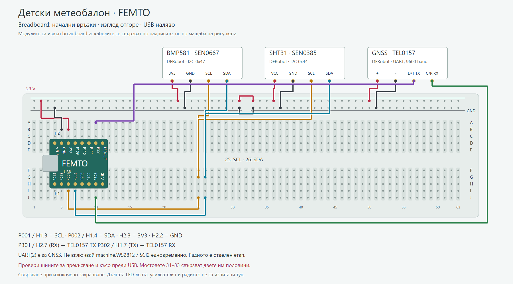
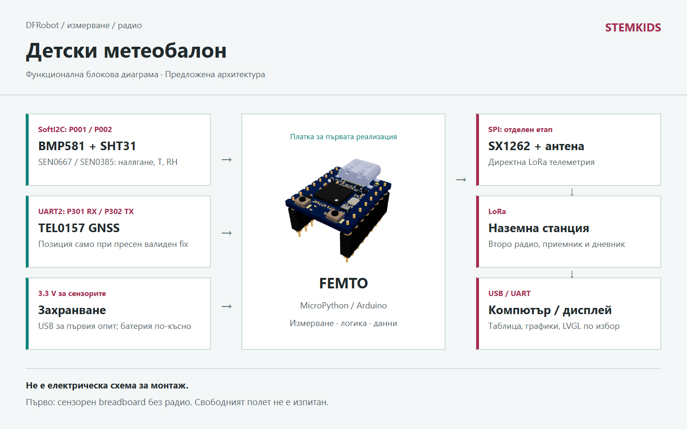

# Детски метеобалон

FEMTO с DFRobot BMP581, SHT31 и GNSS: налягане, температура, влажност и позиция. Блокова схема, breadboard и LoRa телеметрия.

Автор: STEMKIDS / tvendov

## Описание

# Детски метеобалон

Учебен проект на STEMKIDS: измерваме въздуха, записваме резултатите и подготвяме малки пакети за LoRa. Първата реализация е на маса. След нея може да се планира привързан балон с възрастен ръководител. Свободен полет не е включен в готовността на този проект.

## Какво учим

Температурата е колко топъл е въздухът. Налягането е натискът му върху дадена площ. Сензорът превръща тези величини в числа, микроконтролерът ги подрежда, а радиото изпраща пакет до наземна станция. GNSS е отделен приемник, който може да даде позиция и височина. Височина от налягане и GNSS височина не са едно измерване.

## Предложена архитектура

Конкретният проект използва FEMTO: SoftI2C на P001/P002 за датчиците и UART(2) на P301 RX / P302 TX за GNSS. LoRa модул SX1262 по SPI и втора станция са следващ етап. Първата breadboard схема съдържа само сензорите и GNSS. MicroPython и Arduino са програмни варианти. Прикаченият код е Python, без готов Arduino sketch и без хардуерно изпитване.

## Модел с модули DFRobot

Първият модел използва три конкретни модула. FEMTO е контролерът; DFRobot е доставчикът на сензорните платки. Подробният списък и сигналните връзки са във файловете DFROBOT_BG.md и BREADBOARD_BG.md. Оригиналните FEMTO_PINOUT.pdf и FEMTO_SCHEMATIC.pdf са прикачени локално.

- SEN0667, Fermion BMP581: налягане по I2C; захранване 3.3 V, адрес 0x47 по подразбиране. Избираме точно този breakout; Gravity SEN0665 с UART не се приема за автоматична замяна. Наличният локален micropython_bmp581 е кандидат за адаптация; това не е проверена съвместимост с новия модул.
- SEN0385, SHT31 в защитен корпус: температура на въздуха и относителна влажност, I2C 0x44. Поставя се извън топлия корпус, на сянка с въздушен поток. Не е за потапяне. Кабелът и монтажът се включват в реалния тегловен бюджет.
- TEL0157, Gravity GNSS с L76K: позиция и височина. Избираме UART режим, начална настройка 9600 baud по примера на производителя и библиотечния протокол DFRobot_GNSS. Не приемаме, че изходът на този модул е просто необработен NMEA поток.

DFRobot документация: https://wiki.dfrobot.com/sen0667/ и https://wiki.dfrobot.com/sen0385/ и https://wiki.dfrobot.com/tel0157/

BMP581 покрива 300...1250 hPa, не цял стратосферен полет. Под 300 hPa форматът оставя налягането невалидно. Страницата на SEN0667 посочва температурна таблица 0...65 °C; не прехвърляме по-широките граници на самия чип към доказана работа на целия възел при силен студ. За TEL0157 още няма потвърден височинен/динамичен режим за свободен балон. Това е модел за начална наземна и привързана демонстрация.

Делител към ADC може да следи батерията. Стойностите на резисторите се определят по максималното напрежение на батерията и допустимото напрежение на конкретния ADC. Не свързваме батерия направо към аналогов вход.

Източник за BMP581: https://www.bosch-sensortec.com/en/products/environmental-sensors/pressure-sensors/bmp581

## LoRa и LoRaWAN

LoRa е радиомодулация. В директната връзка две радиостанции обменят нашия собствен формат. Трябва да съвпадат честота, bandwidth, spreading factor, coding rate и останалите параметри. Учебните пакети v1 (26 байта) и v2 с влажност (28 байта) не са LoRaWAN пакети. SX1262 остава отделен радиомодул; изборът на DFRobot сензори не го заменя с друг протокол.

LoRaWAN добавя мрежов протокол, gateway и сървър. Не е достатъчно да преименуваме send() на join(). Мрежовите ключове остават извън GitHub. За първата наземна демонстрация предлагаме директна LoRa връзка, а LoRaWAN е следващ отделен етап.

SX1262 има вграден радиочестотен усилвател на мощност. Неговата максимална техническа мощност не е разрешена мощност за всяка честота, антена или държава. Външен PA не е част от началния проект. Първо се проверяват антената, обхватът при ниска мощност, времето в ефир и допустимото използване, включително от въздуха.

Източник за радиото: https://www.semtech.com/products/wireless-rf/lora-connect/sx1262

## Усилватели и захранване

Радиочестотният PA и аудиоусилвателят са различни устройства. Балонът няма нужда от аудиоусилвател за пренос на данни. Приемна антена с неподходящ външен LNA може да влоши работата при силни близки сигнали; не добавяме такъв без измерване.

Батерията захранва защита, главен ключ и стабилизатори. Избираме клетки, държачи, предпазител и преобразувател за реалния температурен и токов режим. Студът влияе на наличната енергия. Не зареждаме литиева клетка извън допустимия от производителя температурен диапазон. Първите тестове са със захранване с ограничение на тока.

## Данни и софтуер

telemetry.py запазва първоначалния 26-байтов формат. telemetry_v2.py добавя влажност с отделен флаг и версия 2, общо 28 байта. Старият приемник отказва v2 вместо да разчита полетата погрешно. Температурата във v2 идва от външния SHT31, не от вътрешния термометър на барометъра.

dfrobot_model.py моделира показанията на трите модула: единици, валидност, изтекла давност и липсващ fix. Коментарите в dfrobot_demo.py показват нормално измерване, загуба на GNSS и датчик извън обхвата. Числата са симулирани; кодът не отваря I2C/SPI/UART, не избира честота и не включва предавател. scan_dfrobot.py приема вече правилно конфигуриран I2C обект и проверява адресите, но не доказва типа на чипа.

Следващият адаптер трябва да свърже реалните драйвери с този формат. Загубен GNSS fix не трябва да изглежда като валидна позиция (0, 0). Липсващи или извъндиапазонни показания се маркират, не се заместват с измислени числа. Пакетът е учебен, без криптографска автентикация; не е управляващ канал за критични функции.

## Безопасност и излизане навън

За заниманията използваме хелий с възрастен, без водород. Балонът, въжетата и бутилката не се обслужват самостоятелно от деца. Не се работи край електропроводи, пътища и летища. Няма нагреватели, пиротехника или автоматичен механизъм за освобождаване в този проект.

Привързаната демонстрация не е автоматично освободена от изисквания. Преди какъвто и да е външен полет организаторът проверява конкретния сценарий с ГД ГВА и въздушното пространство. За свободни безпилотни балони има отделни европейски правила. Тази документация не е разрешение за полет или радиоизлъчване.

- ГД ГВА: https://www.caa.bg/bg/category/246
- EASA, SERA, Appendix 2: https://www.easa.europa.eu/en/document-library/easy-access-rules/online-publications/easy-access-rules-standardised-european?erules-id=ERULES-1963177438-9854
- КРС, свободно използване на спектъра: https://crc.bg/bg/rubriki/740/pravila-za-svobodno-izpolzvane-na-radiochestotniq-spektar

## KiCad и проверка

Прикачената картинка е функционална блокова диаграма, не електрическа схема за монтаж. Сензорният BOM вече има точни DFRobot модули. KiCad проект, окончателен pin map, захранващи компоненти и валидирана електрическа схема предстоят. Няма измислен KiCad линк.

Тествано на платка: Не. MicroPython build: не е избран. Няма изпълнен полетен или RF тест.

## Реализация

Платки: femto
Среда: micropython, host
Библиотеки: chips, machine, radio, lora, lorawan

Тествано: Не
Платка: не е указана
Build: не е указан

Маркерът за тест е посочен от автора на проекта.

## Схеми

## Диаграми

## Код

- [bench\_demo.py](code/bench_demo.py)
- [dfrobot\_demo.py](code/dfrobot_demo.py)
- [dfrobot\_model.py](code/dfrobot_model.py)
- [femto\_bus.py](code/femto_bus.py)
- [scan\_dfrobot.py](code/scan_dfrobot.py)
- [telemetry.py](code/telemetry.py)
- [telemetry\_v2.py](code/telemetry_v2.py)
- [test\_dfrobot\_model.py](code/test_dfrobot_model.py)
- [test\_telemetry.py](code/test_telemetry.py)

## Документи

- [BREADBOARD\_BG.md](documents/BREADBOARD_BG.md)
- [DFROBOT\_BG.md](documents/DFROBOT_BG.md)
- [FEMTO\_PINOUT.pdf](documents/FEMTO_PINOUT.pdf)
- [FEMTO\_SCHEMATIC.pdf](documents/FEMTO_SCHEMATIC.pdf)
- [PLAN\_BG.md](documents/PLAN_BG.md)
- [TECHNOLOGIES\_BG.md](documents/TECHNOLOGIES_BG.md)

## Wiki

# Работен план

1. На компютър: стартирай code/bench_demo.py и code/dfrobot_demo.py. Изпълни тестовете test_telemetry.py и test_dfrobot_model.py. Сравни v1 и v2, влажността и флаговете за липсващи/стари измервания.
2. Използвай FEMTO и запиши точния firmware build. Провери SoftI2C, UART(2) и по-късно избрания SPI/LoRa драйвер. Следвай BREADBOARD_BG.md и сверявай надписите с локалния pinout.
3. На маса: SEN0667 самостоятелно на 3.3 V, после SEN0385. Провери адресите чрез scan_dfrobot.py и единиците на конкретния драйвер: локалният bmp.pressure е в kPa, а пакетът е в Pa. Температурата на въздуха идва от SHT31. Никакво радио на този етап.
4. Добави TEL0157 в UART режим и адаптер за неговия протокол. При изтекла давност или липсващ fix запиши None, не последната позиция като прясна. Измери общия ток с отделните модули.
5. Две наземни LoRa станции: избери разрешен профил, изчисли airtime, приложи ограниченията за предаване и измери загубите на пакети. Физическото положение и поляризацията на антените се записват.
6. Изпитай прекъсване на датчик, загуба на GNSS, спад на захранването, рестарт и пълна памет. Временното изгубване на радио не трябва да спира локалното измерване.
7. KiCad: конкретни модули и конектори, защита на захранването, RF модул с подходяща антена, таблица на пиновете, ERC. После реален монтаж и измервания. Блоковата диаграма не заменя тази стъпка.
8. Само след техническата проверка и проверката на правилата: възрастен организира привързана външна демонстрация. Свободният полет е отделен проектен етап.

## Какво да се записва в протокола

Дата, автор, платка, firmware build, версия на драйвера, действителни пинове, захранване, сензор/адрес, антена, радио профил, условия, очакван и измерен резултат.

## Предстои

- Реални адаптери за SEN0667, SEN0385 и TEL0157; LoRa и наземна станция. Наличието на Arduino/Python пример на DFRobot не е автоматичен порт към machine.I2C/UART.
- Arduino sketch със същите единици и формат, но отделно тестване.
- KiCad схема, PCB и корпус; проверка на тегло, здравина и енергия.
- Потвърден план за допустимо използване на радиото и конкретна демонстрация.

